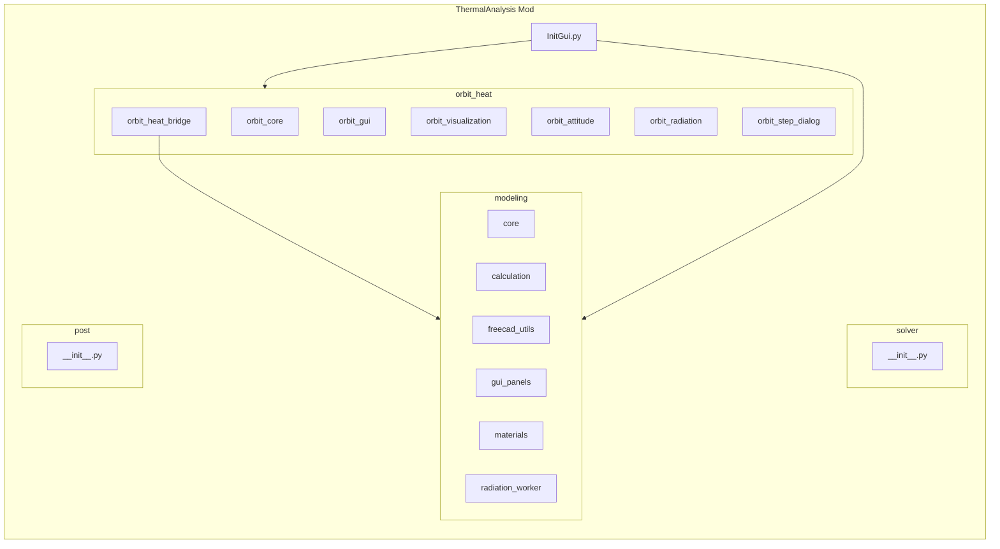

# ThermalAnalysis ワークベンチ統合 実行プラン

## 前提と成果物

- **作成場所**: `FreeCAD/Mod/ThermalAnalysis`（RadiationAnalysis および OrbitHeatWorkbench と同じ階層に新規フォルダを作成）。
- **成果物**: 単一ワークベンチ「ThermalAnalysis」で、modeling（熱モデル・コンダクタンス）と orbit_heat（軌道・軌道熱）の全機能を利用可能にする。solver / post は空のサブモジュールのみ用意する。

## 構成図

---

## Phase 1: ThermalAnalysis ルートと modeling サブモジュール

（省略: 実施済み）

---

## Phase 2: orbit_heat サブモジュールとブリッジ移行

（省略: 実施済み）

---

## Phase 3: InitGui 統合とコマンド ID

（省略: 実施済み）

---

## Phase 4: solver / post プレースホルダと README

（省略: 実施済み）

---

## Phase 5: 動作確認と完了条件

- FreeCAD で **ThermalAnalysis** ワークベンチを選択し、以下を確認する:
  - モデリング: モデル準備、プロパティ編集、熱容量・伝熱・輻射コンダクタンス計算、エクスポート、可視化がエラーなく動作する。
  - 軌道熱: 軌道計算と描画、コマ送り、熱配列 CSV、**輻射モデルに軌道熱を適用** がエラーなく動作する。
- 旧 RadiationAnalysis / OrbitHeatWorkbench の Mod は、上記確認が完了するまで残しておき、必要ならアーカイブまたは削除する。

---

## 課題メモ: 軌道熱入力での「透過」を厳密に扱う

### 背景
- 軌道熱入力（太陽＋アルベド＋地球赤外）では、短波（Solar）と長波（IR）で材料特性が異なるため、透過率は分けて定義・計算する必要がある。
- 現状（2026-03）では orbit_heat は透過率を参照しておらず、`solar_absorptivity` と `ir_emissivity` のみで面入熱を計算している。

### 必要なプロパティ（提案）
- **短波（Solar）**: `SolarTransmittance`（加えて既存の `SolarAbsorptivity`）
- **長波（Infrared）**: `InfraredTransmittance`（加えて既存の `InfraredEmissivity`）
- 反射率は派生で \( \rho_s = 1-\alpha_s-\tau_s \)、\( \rho_{IR} = 1-\varepsilon_{IR}-\tau_{IR} \) と扱う方針。

### 計算モデル案（ユーザー要望）
- 太陽光の透過は **「面を通過して背面側へエネルギーが行く」** として扱う。
- 実装には「同一 Face の front/back ペア」を識別して、入射→透過分を相手面へ加算する処理が必要。

### 未決定事項（後で検討）
- 透過分を **同一ノードの HeatSource に合算**で良いか、それとも **表裏で別ノード化**して背面側ノードへ入れるか。
  - 現状の輻射モデルは表裏で同一ノードのため、合算のみだとノード入熱は変わらず、面別CSV/表示だけが変わる可能性がある。

---

## 課題メモ: 規則反射（鏡面反射）率の定義と輻射計算への組み込み

### 背景
- 現状の輻射計算は、ゲプハルト法により反射を **拡散反射（Lambert）** として扱っている（鏡面成分の区別がない）。
- 規則反射（鏡面反射）を扱うには、反射率の内訳（拡散／鏡面）を定義し、計算モデルを拡張する必要がある。

### 必要なプロパティ（提案）
- `SpecularReflectivity`（鏡面反射率、0～1）
- 拡散反射率は派生で \( \rho_{diff} = \rho - \rho_{spec} \)（ここで \(\rho\) は波長帯ごとの総反射率。短波/長波で分ける場合は別々に定義する）

### 実装案（概要）
- **モンテカルロ（形態係数）側**で「鏡面反射」を追跡し、鏡面経路を含んだ有効形態係数 \(F_{effective}\) を推定する。
  - レイが面に当たったとき、確率 \(\rho_{spec}\) で鏡面反射方向へレイを継続、確率 \(\rho_{diff}\) で拡散扱い（既存のゲプハルト側へ寄せる）などの分岐が候補。
- **ゲプハルト法側**は拡散反射成分のみ（\(\rho_{diff}\)）を使い、多重反射を解く。

### 未決定事項（後で検討）
- 鏡面反射を「何回まで追跡するか」（最大反射回数、減衰閾値）と計算時間のトレードオフ。
- 反射率・透過率を短波/長波で分ける場合のプロパティ設計（`SolarSpecularReflectivity` / `InfraredSpecularReflectivity` 等）。

---

## 課題メモ: 半透明面（例: ガラス）の IR 透過を含むリンク生成の妥当性

### 現状の挙動（2026-03）
- 輻射計算のモンテカルロでは、レイがパッチに当たったとき **確率 \(\tau\)**（`Transmittance`）でそのパッチを「すり抜け」、次に当たる面／空間まで追跡してビューファクターを集計する。
  - そのため、ガラス面の背後にある面は「ガラス越しに見える」面や空間に対して、リンク（Vf 経由の輻射コンダクタンス）が生成され得る。

### 注意点（物理モデルとしての課題）
- 現状の “すり抜け” は **透過のみ**を確率で表現しており、同じ交差イベントでの **吸収・反射の内訳（\(\alpha,\rho,\tau\)）** を厳密には扱っていない。
  - 例: \(\varepsilon=0.6, \tau=0.2\) のとき、残り 0.2 を反射とみなす／吸収とみなす等の整合を明示していない。
- 透過率を 1 パラメータで扱うため、**入射側（表/裏）**や **波長帯（短波/長波）**の違いを表現できない。
- 透過後の放射は、屈折・散乱・内部吸収（厚み依存）を無視した「薄いシート」近似になっている。
- ゲプハルト法（多重反射）との統合方針が未整理（拡散反射のみ仮定のため、半透明＋多重反射の厳密性に課題が残る）。

### 今後の改善案（方向性）
- IR を `InfraredTransmittance` に分離し、\(\rho_{IR} = 1-\varepsilon_{IR}-\tau_{IR}\) のように **エネルギー保存が明確**なパラメータ体系へ移行。
- 半透明面を front/back ペアとして扱い、透過・吸収・反射の寄与を「どの面・どのノードに加算するか」を明確化。
- 必要なら、透過の散乱（拡散透過）／屈折の近似を導入。
